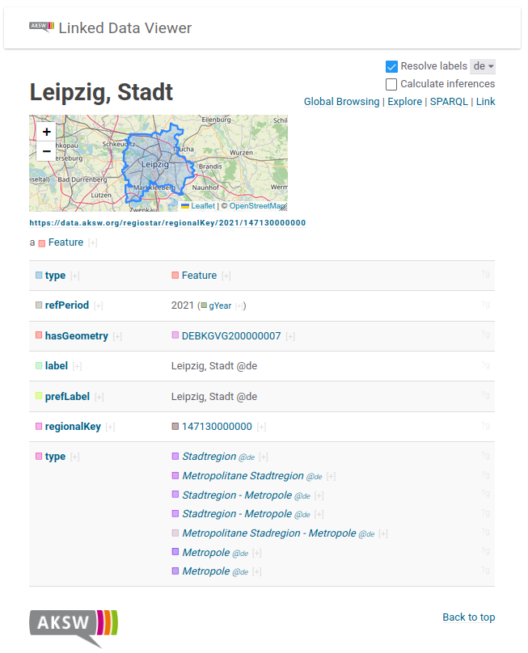
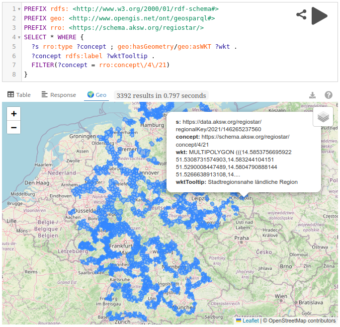

# RegioStaR-RDF




RDFization of the RegioStaR Dataset - including taxonomy, labels and geometries.

The RegioStaR dataset is available from the Mobilithek:

* https://mobilithek.info/offers/689522949364838400

This project also includes polygons from Bundesamt für Kartographie und Geodäsie (BKG):

* HTML page: https://gdz.bkg.bund.de/index.php/default/verwaltungsgebiete-1-250-000-mit-einwohnerzahlen-stand-31-12-vg250-ew-31-12.html
* The raw files can be viewed at https://daten.gdz.bkg.bund.de/produkte/vg/vg250-ew\_ebenen\_1231/2021/
* The concretely used product by this RDFization project is [vg250-ew_12-31.utm32s.gpkg.ebenen.zip](https://daten.gdz.bkg.bund.de/produkte/vg/vg250-ew_ebenen_1231/2021/vg250-ew_12-31.utm32s.gpkg.ebenen.zip)


## Sources and Licenses

This derived RegioStaR-RDF dataset is provided under the
Datenlizenz Deutschland – Namensnennung – Version 2.0:
https://www.govdata.de/dl-de/by-2-0

The source code of project is licensed under the Apache License, Version 2.0.

Sources
=======

1. RegioStaR – Regionalstatistische Raumtypisierung
   Publisher: Bundesministerium für Digitales und Verkehr
   Source: https://mobilithek.info/offers/689522949364838400
   Licence: dl-de/by-2-0
   Data transformed into RDF.

2. Verwaltungsgebiete 1:250 000 mit Einwohnerzahlen
   (VG250-EW), territorial reference date 31 December 2021
   © BKG (2026) dl-de/by-2-0
   Source data landing page: https://gdz.bkg.bund.de/index.php/default/verwaltungsgebiete-1-250-000-mit-einwohnerzahlen-stand-31-12-vg250-ew-31-12.html
   Source daat download page: https://daten.gdz.bkg.bund.de/produkte/vg/vg250-ew\_ebenen\_1231/2021/
   Concretely used product: [vg250-ew_12-31.utm32s.gpkg.ebenen.zip](https://daten.gdz.bkg.bund.de/produkte/vg/vg250-ew_ebenen_1231/2021/vg250-ew_12-31.utm32s.gpkg.ebenen.zip)
   Data transformed into RDF

## Useful SPARQL Queries

### RegioStaR Taxonomy

```sparql
PREFIX skos: <http://www.w3.org/2004/02/skos/core#>
PREFIX rdfs: <http://www.w3.org/2000/01/rdf-schema#>
PREFIX rrr: <https://data.aksw.org/regiostar/>
PREFIX rro: <https://schema.aksw.org/regiostar/>

SELECT ?schemeLabel ?concept ?conceptLabel WHERE {
  ?scheme a rrr:RegioStaRScheme .
  ?concept skos:inScheme ?scheme .
  
  ?scheme rdfs:label ?schemeLabel .
  ?concept rdfs:label ?conceptLabel
}
```

### Regiopoles

```sparql
PREFIX geof: <http://www.opengis.net/def/function/geosparql/>
PREFIX rr: <http://www.w3.org/ns/r2rml#>
PREFIX geo: <http://www.opengis.net/ont/geosparql#>
PREFIX rdf: <http://www.w3.org/1999/02/22-rdf-syntax-ns#>
PREFIX rdfs: <http://www.w3.org/2000/01/rdf-schema#>
PREFIX rrr: <https://data.aksw.org/regiostar/>
PREFIX rro: <https://schema.aksw.org/regiostar/>

SELECT (geof:simplifyDp(geof:aggUnion(?wkt), 0.01) AS ?union) WHERE {
  ?s geo:hasGeometry/geo:asWKT ?wkt .
  ?s rro:regioStaR4 ?x . ?x rdfs:label ?l
  # FILTER(?x = <https://data.aksw.org/regiostar/concept/2/2>) # Ländliche Region
  FILTER(?x = rrr:concept\/4\/12) # Regiopolen
}
```

